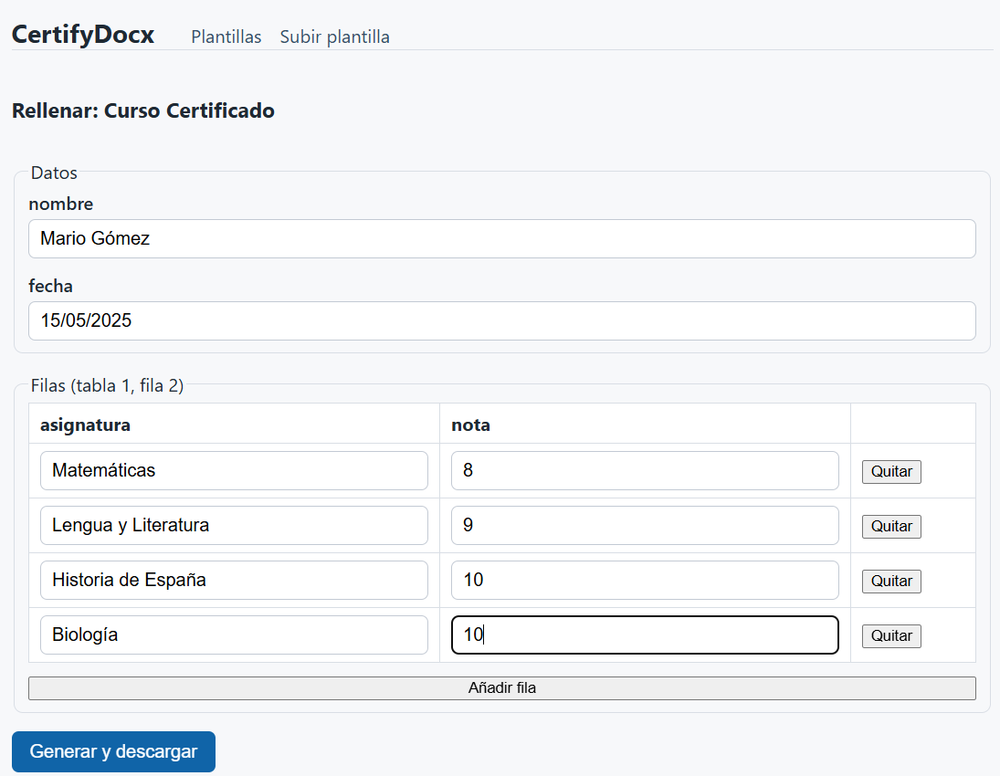
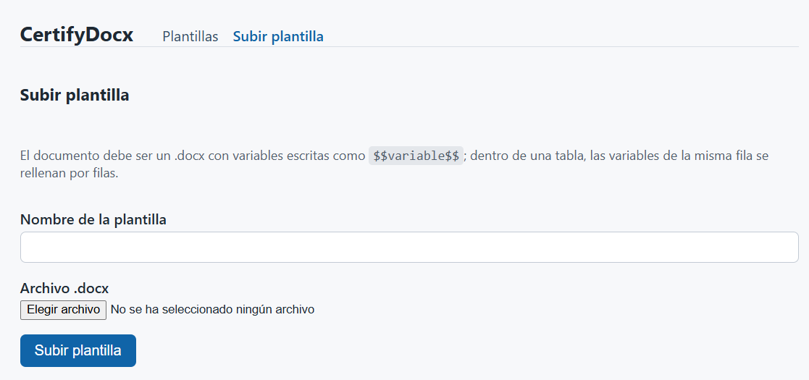

# CertifyDocx — Automatización de Certificados

> **Generación automática de certificados desde plantillas Word** | Desarrollado con **SDD** (Spec-Driven Development) + IA en 2026



## El problema

Organizaciones, academias y departamentos de formación emiten cientos de certificados casi idénticos. Editarlos manualmente por persona es **lento, propenso a errores** y no escala.

## La solución

**CertifyDocx** automatiza el proceso en 3 pasos:

1. **Sube** una plantilla Word con variables marcadas (`$$variable$$`)
2. **Detecta** automáticamente los campos y genera un formulario
3. **Descarga** el documento rellenado en segundos — sin errores de transcripción




## Cómo funciona

**Backend (VB.NET + SQL Server)**
- Núcleo de procesamiento sin dependencias externas: analiza `.docx`, detecta variables simples y de tabla
- API REST que valida, almacena y genera documentos

**Frontend (React)**
- Interfaz intuitiva para subir plantillas y rellenar formularios
- Descarga directa del certificado generado

```
http://localhost:5173/
```

## Metodología: SDD (Spec-Driven Development)

Este proyecto fue desarrollado siguiendo **Spec-Driven Development**, una metodología que usa agentes de IA guiados por especificaciones claras, no por prompts improvisados.

Cada artefacto del proyecto tiene su origen documentado:

- **Constitución** → Principios innegociables (core sin dependencias, separación de capas, tests obligatorios)
- **Especificación** → 11 requisitos funcionales claros (RF-1 a RF-11 en notación EARS)
- **Planificación** → Arquitectura: módulos, modelo de datos, decisiones técnicas
- **Tareas** → Implementación incremental con tests primero
- **Validación** → Cada RF cubierto por tests automatizados

**Resultado:** una arquitectura escalable, mantenible y documentada desde cero.

## Stack

| Componente | Tecnología |
|---|---|
| Backend | VB.NET, SQL Server |
| Frontend | React, TypeScript, Vite |
| Testing | Unit tests (VB.NET), E2E manual |
| Arquitectura | Separación de capas: Web → API → Core + Data |

## Principios de desarrollo

✓ **Núcleo sin dependencias** — VB.NET Core solo usa BCL, recibe bytes y datos, devuelve bytes  
✓ **Spec antes que código** — Ninguna funcionalidad sin especificación activa  
✓ **Tests como criterio de "hecho"** — Implementación test-first  
✓ **Separación de capas** — Web solo habla con API por HTTP  
✓ **IA guiada por especificaciones** — No improvisación, valor reproducible  

## Empezar

```bash
# Desarrollo local
cd docu-builder/src/CertifyDocx.Web
npm install
npm run dev
```

La app estará disponible en `http://localhost:5173/`

## Documentación del proyecto

- [Constitution](./docu-builder/docs/constitution.md) — Principios del proyecto
- [Especificación MVP](./docu-builder/specs/001-certificados-mvp/spec.md) — Requisitos funcionales (RF-1 a RF-11)
- [Plan técnico](./docu-builder/specs/001-certificados-mvp/plan.md) — Arquitectura y decisiones
- [Tareas](./docu-builder/specs/001-certificados-mvp/tasks.md) — Implementación

---

**Fork del curso SDD de [MoureDev](https://moure.dev)** — Adaptado a una temática de negocio real, manteniendo la metodología de desarrollo con IA.

## El flujo SDD en una línea

Constitución → Spec → Clarificación → Plan → Tareas → Implementación (una tarea cada vez, tests primero) → Validación → Cambio (primero la spec, luego el código).

##  Hola, mi nombre es Brais Moure.

[](https://youtube.com/mouredevapps?sub_confirmation=1)
[](https://mouredev.com/discord)


Soy ingeniero de software desde 2010. Desde 2018 combino mi trabajo como desarrollador con la creación de contenido formativo y divulgativo sobre programación e IA en diferentes redes sociales como **[@mouredev](https://moure.dev)**.

Si quieres unirte a nuestra comunidad de desarrollo y aprender programación e inteligencia artificial, puedes encontrarme en:

[](https://mouredev.pro)
[](https://moure.dev)